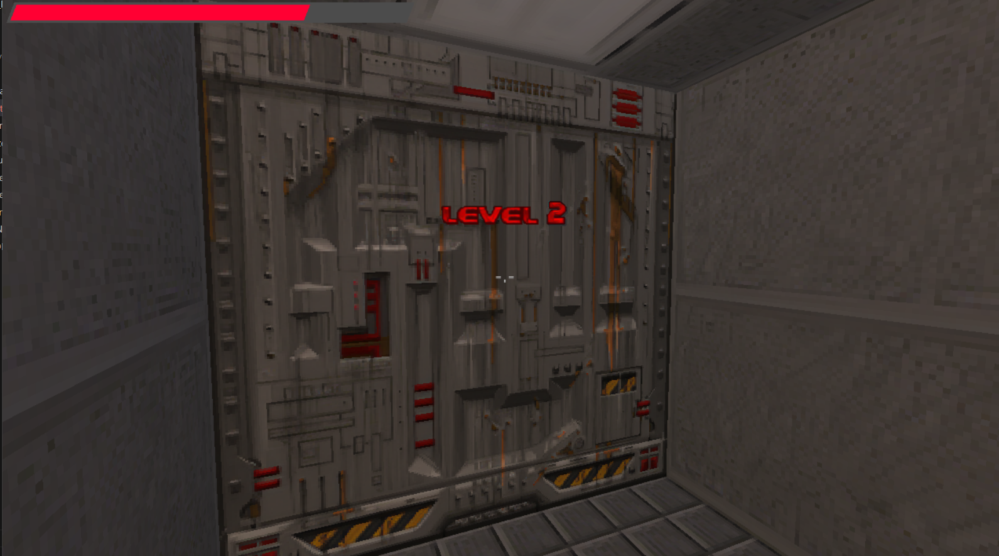
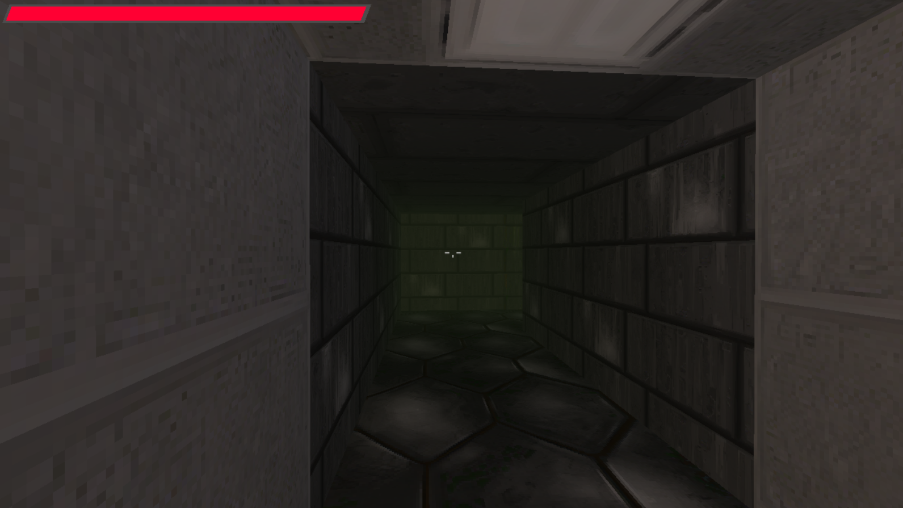
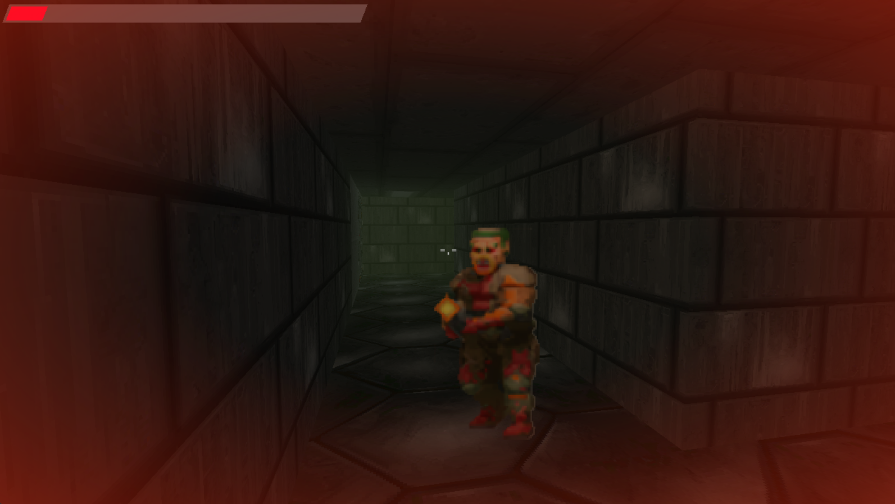
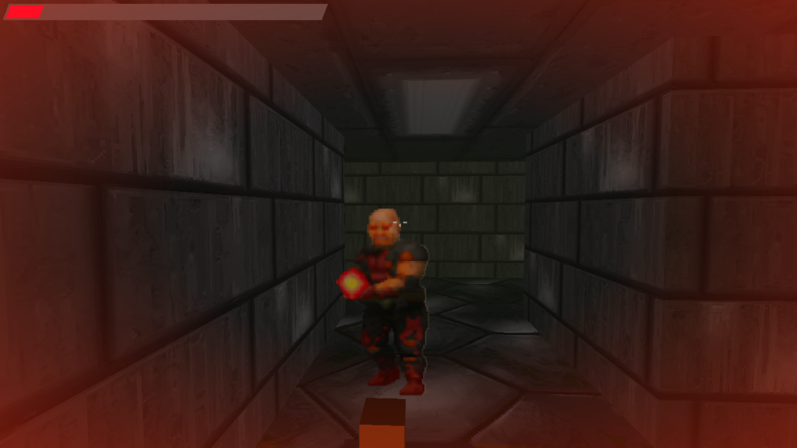

# G11_Grafos_PA-26.2

# Doom Epic Maze A Star Upgrade

Número da Lista: 11 <br>
Conteúdo da Disciplina: algoritmo A*, grafos, heap. <br>

## Alunos
| Nome | Matrícula |
| :--- | --- |
| Davi Monteiro de Negreiros | 232013971 |
| Guilherme Davila Rodrigues Carneiro Sampaio | 221029220 | 

## Sobre
Inspirado na franquia de jogos [Doom](https://pt.wikipedia.org/wiki/Doom_(série_de_jogos)) o jogo [Doom Epic Maze](https://github.com/d-002/maze) é um python game onde você tenta achar o portão de saída do labirinto e ir para o próximo nível, onde um labirinto maior ainda gerado de forma procedural estará esperando por você. Tome cuidado com os monstros no caminho que tentarão te impedir de chegar no final! <br><br>
O projeto "Doom Epic Maze A Star Upgrade" é um incremento ao jogo Doom Epic Maze de [d-002](https://github.com/d-002) aplicando um algoritmo (A*) de perseguição aos inimigos do jogo. Assim, mesmo que você fuja ou se esconda os personagens irão te perseguir dentro do labirinto até te encontrar! <br><br>
[Link do repositório original](https://github.com/d-002/maze).

## Video
Gravação da apresentação do projeto:
[](https://youtu.be/gQlJT5Wo42E)
<br><br>

## Screenshots
<p align="center">
  
  <br>
  <i>Elevador inicial</i>
</p>
<p align="center">
  
  <br>
  <i>Labirinto</i>
</p>
<p align="center">
  
  <br>
  <i>Inimigo 1</i>
</p>
<p align="center">
  
  <br>
  <i>Inimigo 2</i>
</p>

## Instalação
Linguagem: python (Recomendado: 3.11)<br>
Utiliza biblioteca pygame.<br>

Pré-requisitos: 
- pygame>=2.0.0
- pyopengl
- numpy
- pypresence

Comandos para instalar pré-requisitos:
```console
PS C:\Projeto> cd src
PS C:\Projeto\src> py -3.11 -m venv .venv
PS C:\Projeto\src> .\.venv\Scripts\python -m pip install --upgrade pip
PS C:\Projeto\src> .\.venv\Scripts\python -m pip install -r requirements.txt
```
<br>

Comando para rodar o jogo:
```console
PS C:\Projeto\src> .\.venv\Scripts\python main.pyw
```

## Uso
Ao iniciar o jogo ele irá abrir uma janela em tela cheia e você já estará jogando.

#### Controles
| Função | Input |
| --- | --- |
| Atirar | Botão esquerdo do mouse |
| Abrir portas | Botão direito do mouse |
| Movimentação | WASD |
| Agachar | Shift |
| Correr | Ctrl |
| Sair | Esc |


## Outros
****Créditos****:
**Textures**: [doomworld.com](https://www.doomworld.com/forum/topic/99021-doom-neural-upscale-2x-v-10)  
**Music**: [Tunnel Vision](https://youtu.be/Q6yqbGicwUo), de [d-002](https://github.com/d-002)  
**SFX**: edited from [pixabay.com](https://pixabay.com)  
[Link do repositório original](https://github.com/d-002/maze) de [d-002](https://github.com/d-002)  
